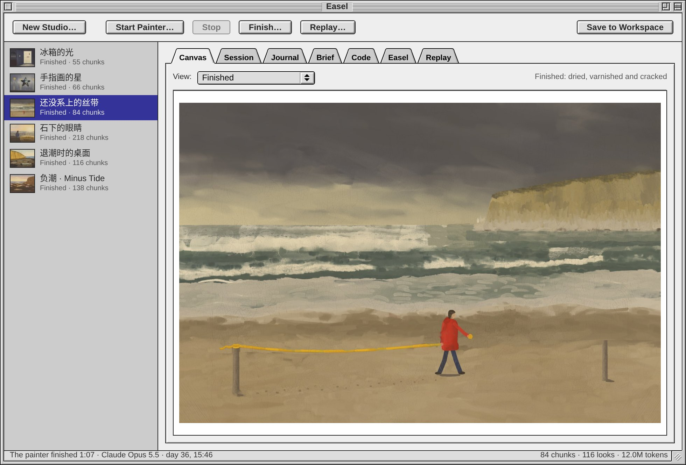
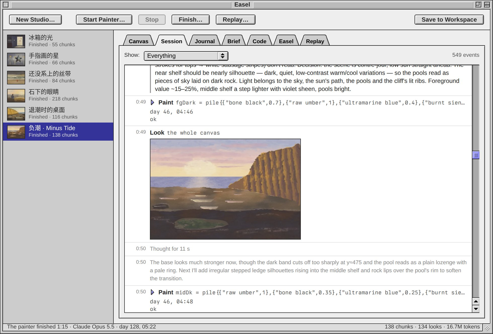

# exe-easel

Easel is an app for the [exe](https://github.com/livid/exe) desktop: oil
paintings made by Claude painters at a simulated easel, watched live and
kept, in a Mac OS 9 Platinum window.



The simulator is [claude-paint](https://github.com/aliceisjustplaying/claude-paint)
by Alice (MIT), the engine behind [stillwet.art](https://stillwet.art):
simulated bristles carry wet paint over primed linen, the paint levels and
dries on a clock, and layers combine by Kubelka–Munk optics. It is the
`engine` submodule here, used as published. This repository adds:

| path | what |
|---|---|
| `harness/claude/` | the painter for Claude Code: claude-paint's painter tools (`paint`, `look`, `note`, `status`, `log`, `read`) as an MCP server, and `paint <studio>`, one headless Claude Code session with those tools and nothing else |
| `server/` | `exe-easel`, a small Go daemon (stdlib only) that keeps the studios: it exports them, starts and stops painters, follows their sessions, finishes and films the paintings by itself, and serves it all to the app (`server/API.md`) |
| `apps/easel/` | the Easel app: the studios, each painter's canvas, session, journal, brief and log, a console for painting by hand, the replay |
| `projects/haixing/` | an example: six painters illustrating the six chapters of a short story |
| `tests/` | headless checks of the app |



## Setting it up

With Claude Code, paste this:

> Set up exe (github.com/livid/exe) and its Easel app (github.com/livid/exe-easel) on this machine by following their READMEs, asking me before installing anything. Keep it local: in `~/.exe/config.json` put every listen address on 127.0.0.1, set an `api_token`, and expose nothing through Tailscale or Cloudflare; then tell me the token and how to open Easel.

By hand:

You need [exe](https://github.com/livid/exe), Claude Code (signed in), Go 1.26
or newer, Rust 1.84 or newer (`rustup update`), Node 23.6 or newer,
[uv](https://docs.astral.sh/uv/) (the engine runs its scripts with it), and
FFmpeg with `ffprobe` and libx264 for the replays. On macOS:
`brew install go node uv ffmpeg`. Linux and macOS both work.

```sh
git clone --recurse-submodules --shallow-submodules https://github.com/livid/exe-easel
cd exe-easel/server
make check     # says what is missing, before anything is installed
make install   # builds the engine's replay easel and the daemon, and runs it on
               # 127.0.0.1:7794 as a systemd user unit (Linux) or a launchd agent (macOS)
```

Then tell exe about it, in `~/.exe/config.json` or with `PUT /v1/config`:

```json
"services": { "easel": "http://127.0.0.1:7794" },
"apps_dirs": [ "…", "/path/to/exe-easel/apps" ]
```

Easel shows on the desktop. **New Studio…** makes a studio (an easel, a box
of tubes and a brief), **Start Painter…** sets a painter to work, and the
window follows it. A finished painting is varnished, its views are drawn and
its replay filmed without anyone asking.

## Notes

- Painters run in transient systemd user units (`exe-easel-<studio>`) on Linux
  and in sessions of their own on macOS, and outlive the daemon. Studios live in `studios/`; nothing there is committed.
- What goes wrong, in the app or the daemon, is written to `logs/error.log`.
  When the daemon starts it checks for FFmpeg, the replay easel, node and
  claude; anything missing is in that log, at `GET /v1/health`, and in an
  alert when the Easel window opens. `make uninstall` removes the service.
- claude-paint's README asks that its benchmark data never appear in training
  corpora; this repository carries none of it (the submodule points at the
  original).
